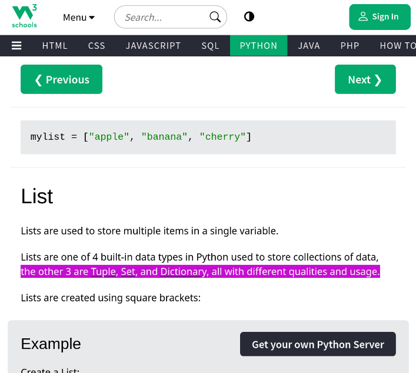
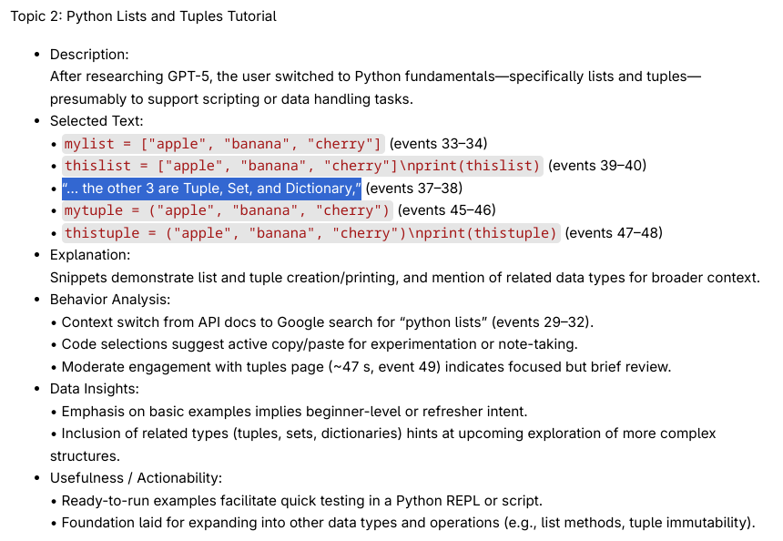
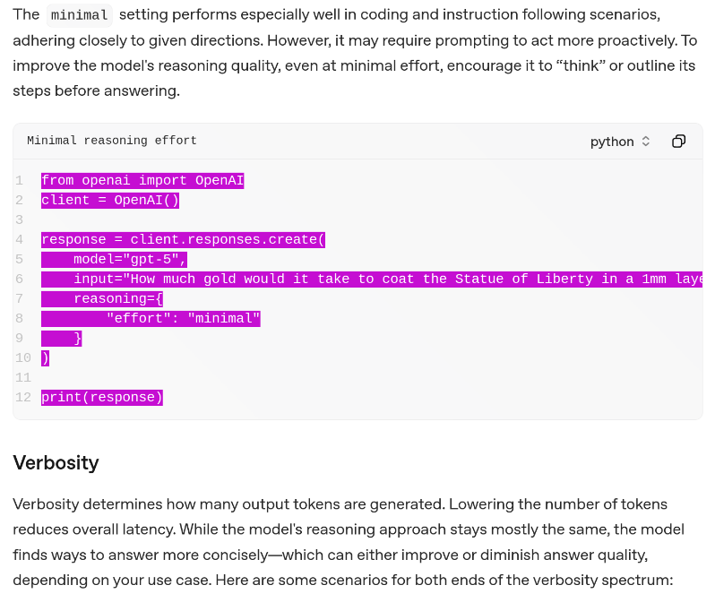
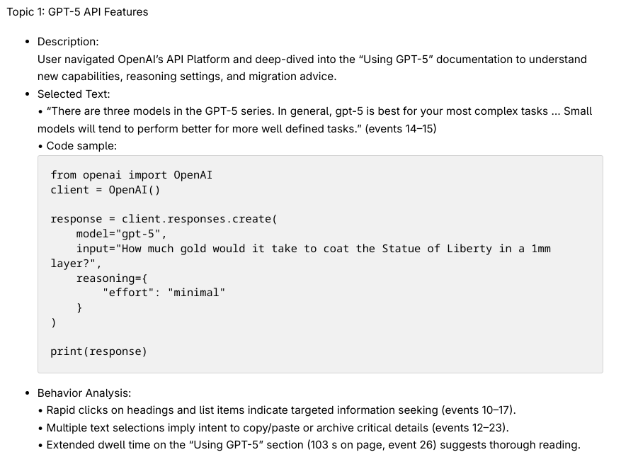
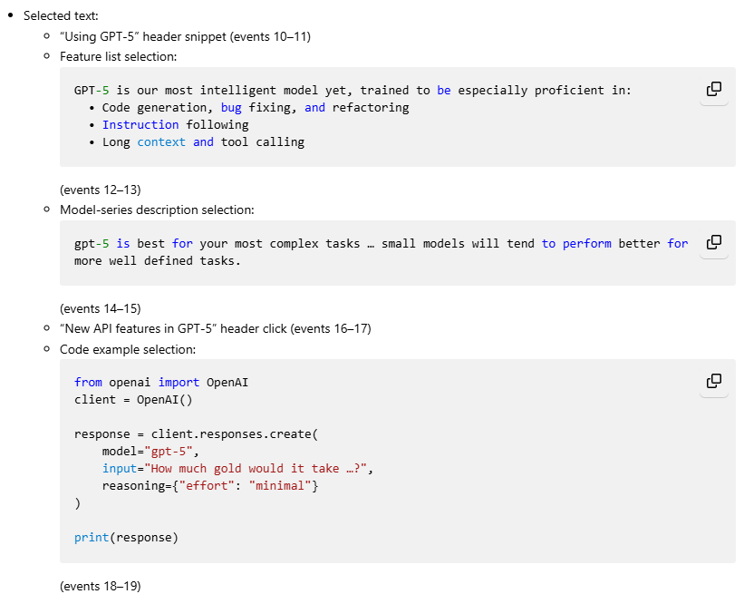
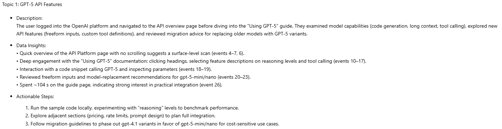
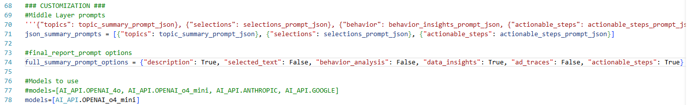
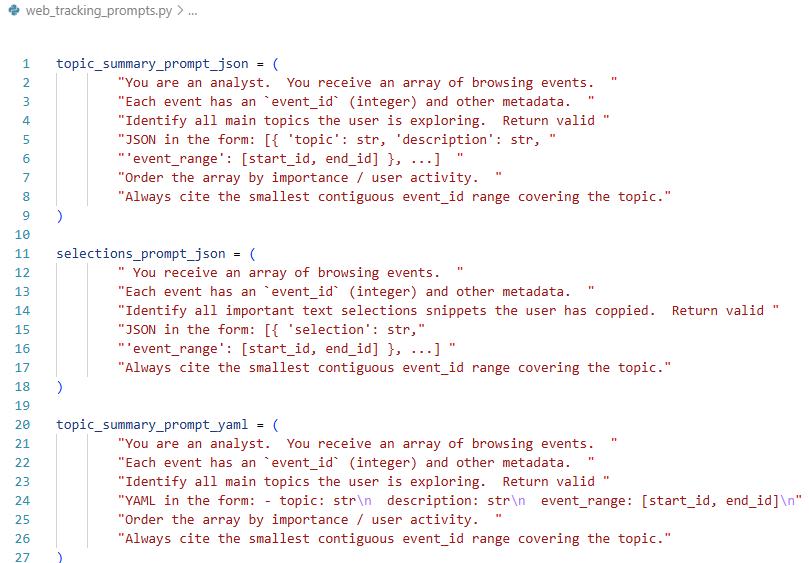
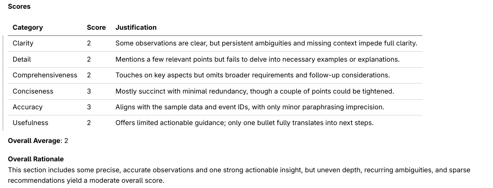
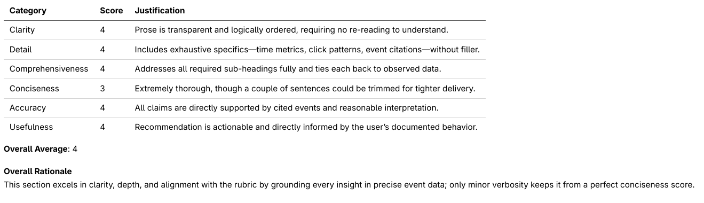

# Smart Highlighter

**Smart Highlighter** is a browser extension that enhances your web browsing by supercharging your cursor with **state-of-the-art LLM reasoning**.  
Highlight content, capture your intentions, and get **AI-powered research reports** — all while you browse.

---

## Quick Start — For Basic Users

1. **Install the Extension** [Temporary Firefox Install Instructions Below](#web-extension-installation). > **Note:** link and mention app in store coming soon
2. **Browse Normally** — highlight text, click, and scroll to communicate information to the AI.
3. **Review Reports** — visit [aiapi.cybernautics.net](https://aiapi.cybernautics.net) to see AI-generated summaries of what you read.
4. **Give Feedback** — improve your personal AI summaries by rating and commenting on them.

**Example in Action:**  

| Browser with Highlighting | Resulting `Smart  Highlighter Report` | 
|---------------------------|---------------------------------------|
|||

---

## Web Extension Installation

> **Note:** This product will be available in the Firefox Add-ons store once development is complete. Until then, install it manually using the steps below.

### Temporary Installation (Firefox)
1. Go to the **Smart Highlighter GitHub repository** and download the latest release.
2. In Firefox, navigate to:  
   `about:debugging#/runtime/this-firefox`  
   (or open **Extensions → Cog Icon → Debug Add-ons**).
3. Click **Load Temporary Add-on**.
4. Select the downloaded extension folder.

Once loaded:
- Click the **Smart Highlighter** icon and set your **username**.
- A **red “Tracking is active”** indicator will appear on webpages to ensure transparency.

---

## Advanced Features — For Power Users

Make it your own. Customize how your data gets processed and what is included in your report.

- [**Data Guides Browsing**](#1-understanding-data-guides-browsing) — See what data is collected and how it is used to guide how you browse for stronger reports.
- [**Customize Prompts**](#2-control-reports-through-custom-prompts-and-preferences) - Choose from pre-written prompt options to shape your report’s style and focus.
- [**Code Philosophy**](#3-code-philosphy-and-organization) — Understand the architecture and data flow within the project and how to get started in the code.
- [**Additional Services**](#4-additional-services) — Contact me and see what else I offer.
  
## 1. How Data Guides Browsing

**What you get from your data**
- Save notes for things you find interesting or want to reference later by clicking on it or selecting it
  - By clicking or selecting the same thing multiple times, you can emphasize how important something is for the report
- Time and scroll data for each page can indicate how focused and invested you are in the content. If you scroll a lot but only spend a couple minutes on a long page, the report will indicate that you skimmed through it without reading it deeply.
- Additional specific queries for this data can be found in the [prompt customization](#32-where-to-hack-prompts) section below.
When you click in the browser

- Data collected includes
  - Where you clicked
  - What you clicked on
  - What you highlight or select
  - The URLs you visit
  - The time you spend on each web page
  - The amount you scroll through the page

> **Note** The entire text of the webpage is _not_ collected. This could be implemented in the future, or the backend can do web searches for links you visited for more information to include in the reports.

- Data is gathered by the server
  - Free hosting at [aiapi.cybernautics.net](aiapi.cybernautics.net)
  - [Local hosting instructions below](#backend-installation-for-self-hosting)

## 2. Control Reports Through Custom Prompts and Preferences

Customize the prompts in the program to create your ideal report outputs.

[See prompt customization section below](#32-where-to-hack-prompts)

Preset options you can control are:
- Descriptions of Topics
  - Recieve summaries of what topics you were exploring while browsing and generally what was learned
- Text Selections
  - Customize how much of what you select shows up in the end report. For example, display everything or just the most relevant few.
- User Behavior Insights
  - Review what you were focused on based on how you scrolled, clicked, and interacted with each webpage. 
- Data Insights
  - Deeper analysis of the raw data captured and what it means in the context of each topics.
- Ad Traces
  - Filter ads out of the rest of your report and list them in this section
- Actionability and Next Step Suggestions
  - Recieve suggestions about what to research or work on next

**Example:**

| View in Browser |  Generalist | 
|-----------------|-----------------|
|||
| Selection Focus | Data Insights |
|||

---
## 3. Code Philosphy and Organization
Hack, Self-Host, or contribute

### 3.1 How It Works
1. **Web Extension** — The Firefox web extension listens for events while you are browsing. It captures clicks, links, tabs, highlights, scrolling, and afk detection. More features will be added as the project develops.
2. **Backend Log** — When events are logged by the web extension, they are transmitted securely to the backend server via HTTPS. Here events are logged and added to an ndjson raw log file, where your browsing history is accumulated and ready to be processed further.
3. **Report Generation** — Report generation runs on usage amount and a timer throughout the day.
   - LLM processes data in chunks based on target number of words, optimized for LLM model capabilities
   - Desired Data is extracted and analyzed individually before being compiled into a full report. LLM requests are made for each option below and stored in json files you can view:
     - Topic Overviews and descriptions.
     - Selections of text.
     - Behavior Insights based on how you interact with the browser.
     - Actionable next step suggestions.
   - Full Summaries are generated by an LLM using data from the last step, the raw log events, and our hand-crafted prompt that ties everything together.
   - Optionally, the full summary is sent to our LLM as a Judge evaluation to be scored for the current setup of LLM model choice and prompt choices.
4. **Viewing** All output is available to you at [aiapi.cybernautics.net](https://aiapi.cybernautics.net), including latest full summaries and middle layer data files.

### 3.2 Where to hack prompts

To personalize your AI reports:
1. Open `web_tracking_pipeline.py` and edit lines **66–72** to adjust preset prompt options.
2. Edit or add new prompt templates in `web_tracking_prompts.py`.

**Example:**

`web_tracking_pipeline.py`

  

---

`web_tracking_prompts.py`



---

### 3.3 Control Costs while Retaining Quality with Evaluations

> **Note:** Evaluations are a combination of automated LLM analysis and user reports. Over time, these reports will be aggregated and displayed in a graph in this documentation.

Smart Highlighter can evaluate your browsing activity using AI scoring to help measure research quality, depth, and alignment with your goals. Control costs while maintaining confidence that your summaries meet your standards of quality.

A good report should:
- Present the information in an obvious and understandable way      (clarity)
- Contain all desired information                                   (detailed)
- Follow all instructions concerning the ouptut format and contents (comprehensive)
- Avoid unnecessary wording or redundant information                (concise)
- Ensure factual accuracy with the original raw data                (accurate)
- Provide actionable and helpful information                        (useful)

Example evaluations:

Normal vs Heavy usage range

|Model|**GPT4o:** |**GPT o4 mini:** |**claude-opus-4**|**gemini-2.5-pro**|
|-----|-----------|-----------------|----------|----------|
|Cost Per Day|$1.25-$3.75|$0.15-$0.45|$4.50-$13.50|$0.50-$1.70|

|Model|**GPT4o:** |**GPT o4 mini:** |
|-----|-----------|-----------------|
|eval|||

> **Note** Cost per day is an estimate and will vary based on browsing activity

Evaluations can also be used to:
- Track improvement over time.
- Compare different research sessions.
- Provide feedback loops for AI prompt tuning.

---

## 4. Additional Services

Contact me for private deployment, customization, integration, or any assistance with the project.
cithoreal@gmail.com

---


## Backend Installation (For Self-Hosting)

### 1. Clone the Repository
```bash
git clone <backend-repo-url>
cd smart-highlighter-backend
```

### 2. Configure Environment Variables
Create a `.env` file in the project root:
```env
OPENAI_API_KEY=sk-*************
ANTHROPIC_API_KEY=*******
HUGGINGFACE_API_KEY=******************
GOOGLE_AI_API_KEY=***********************
HTTPS=true
Port=8443
```

### 3. Manual Installation
Clone the smart-highlighter-backend repository
Open the repo folder inside a terminal

Run:
```bash
python -m venv venv
source venv/bin/activate   # Linux/macOS
venv\Scripts\activate      # Windows
pip install -r requirements.txt
```
```bash
Run fastapi_server.py with python # Hit run in an IDE like vscode 
```
or in a terminal run
```bash
python fastapi_server.py 
```
Or
### 4. Docker Installation

Run:
```bash
docker-compose up -d --build
```

```bash
visit 127.0.0.1:8443 and accept the certification you generated by running the app
```
---

## **Future Roadmap**
- Firefox Add-ons store release.
- More AI models & custom prompt packs.
- Automated tab grouping and suggestions
---

Evaluation Discussion:

- [Raw Log Trace](Documentation/Evaluation/web_tracking_log.ndjson)
- [Spreadsheet Notes](Documentation/Evaluation/Eval_Spreadsheet.xlsx)
- [Handwritten Report](Documentation/Evaluation/manual_report.md)
- [LLM Reports](Documentation/Evaluation/LLM_Report_Output)
- [LLM Judge Outputs](Documentation/Evaluation/LLM_Judge_Output)
