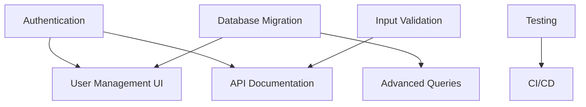

# Tasks and Priorities

**Last Updated**: 2025-01-15  
**Project**: Smart Highlighter Backend

## Priority Legend
- 🔴 **Critical** - Security/data integrity issues, blocks production
- 🟡 **High** - Important features, technical debt, performance
- 🟢 **Medium** - Nice-to-have improvements, refactoring
- 🔵 **Low** - Future enhancements, optional features

## Status Legend
- ⏸️ Not Started
- 🔄 In Progress
- ✅ Completed
- ❌ Blocked
- 🧪 Testing

---

## 🔴 Critical Priority

### Security & Authentication

#### 1. Implement User Authentication
**Status**: ⏸️ Not Started  
**Priority**: 🔴 Critical  
**Effort**: High (3-5 days)

**Description**: Replace trusted `X-User-ID` header with proper authentication.

**Implementation Options**:
1. **JWT Tokens** (Recommended for API)
   ```python
   from fastapi.security import HTTPBearer
   from jose import jwt
   
   security = HTTPBearer()
   
   @app.post("/api/log")
   async def receive_event(
       event: dict,
       token: str = Depends(security)
   ):
       user_id = verify_jwt(token)
       ...
   ```

2. **OAuth2** (For browser extension)
   - Use GitHub/Google OAuth
   - Store refresh tokens securely
   - Extension handles OAuth flow

3. **API Keys** (Simple, immediate)
   - Generate per-user API keys
   - Store hashed in database
   - Validate on each request

**Subtasks**:
- [ ] Choose auth strategy
- [ ] Implement token generation/validation
- [ ] Add `/auth/login`, `/auth/register` endpoints
- [ ] Update browser extension to handle auth
- [ ] Migrate existing `X-User-ID` references
- [ ] Add token refresh mechanism
- [ ] Document auth flow in `PROJECT_DOCS.md`

**Dependencies**: None  
**Blocks**: Production deployment

---

#### 2. Add Input Validation
**Status**: ⏸️ Not Started  
**Priority**: 🔴 Critical  
**Effort**: Medium (1-2 days)

**Description**: Create Pydantic models for all request payloads to prevent injection attacks and data corruption.

**Implementation**:
```python
from pydantic import BaseModel, Field, HttpUrl, validator

class TrackingEvent(BaseModel):
    url: HttpUrl
    action: Literal["pageview", "click", "scroll", "selection"]
    timestamp: Optional[datetime] = None
    selected_text: Optional[str] = Field(None, max_length=10000)
    time_on_page: Optional[float] = Field(None, ge=0)
    
    @validator('action')
    def validate_action(cls, v):
        allowed = ["pageview", "click", "scroll", "selection"]
        if v not in allowed:
            raise ValueError(f"Action must be one of {allowed}")
        return v
    
    class Config:
        extra = "allow"  # Still allow dynamic fields
```

**Subtasks**:
- [ ] Define `TrackingEvent` model
- [ ] Add validation to `/api/log` endpoint
- [ ] Create models for query parameters
- [ ] Add error handling for validation failures
- [ ] Test with malformed inputs
- [ ] Update browser extension to match schema

**Dependencies**: None  
**Blocks**: Data integrity

---

#### 3. Fix CORS Configuration
**Status**: ⏸️ Not Started  
**Priority**: 🔴 Critical  
**Effort**: Low (1 hour)

**Description**: Replace wildcard CORS with environment-specific origins.

**Implementation**:
```python
# In fastapi_server.py
ALLOWED_ORIGINS = os.getenv(
    "ALLOWED_ORIGINS",
    "http://localhost:3000"
).split(",")

app.add_middleware(
    CORSMiddleware,
    allow_origins=ALLOWED_ORIGINS,
    allow_credentials=True,  # Now safe with specific origins
    allow_methods=["GET", "POST"],
    allow_headers=["Content-Type", "Authorization"],
)
```

**Subtasks**:
- [ ] Add `ALLOWED_ORIGINS` to `.env.example`
- [ ] Update `docker-compose.yml` with env var
- [ ] Test with browser extension from allowed origin
- [ ] Test rejection from disallowed origin
- [ ] Document in `PROJECT_DOCS.md`

**Dependencies**: None  
**Blocks**: Production deployment

---

#### 4. Path Sanitization
**Status**: ⏸️ Not Started  
**Priority**: 🔴 Critical  
**Effort**: Low (2 hours)

**Description**: Validate `user_id` to prevent directory traversal attacks.

**Implementation**:
```python
import re
from fastapi import HTTPException

def validate_user_id(user_id: str) -> str:
    """Ensure user_id contains only safe characters."""
    if not user_id:
        raise HTTPException(400, "user_id required")
    
    if not re.match(r'^[a-zA-Z0-9_-]+$', user_id):
        raise HTTPException(400, "Invalid user_id format")
    
    if len(user_id) > 50:
        raise HTTPException(400, "user_id too long")
    
    # Prevent directory traversal
    if ".." in user_id or "/" in user_id or "\\" in user_id:
        raise HTTPException(400, "Invalid user_id")
    
    return user_id

# Use in endpoints
@app.post("/api/log")
async def receive_event(
    event: dict,
    user_id: str = Header(None, alias="X-User-ID")
):
    user_id = validate_user_id(user_id)
    ...
```

**Subtasks**:
- [ ] Create `validate_user_id()` helper
- [ ] Apply to all endpoints using `user_id`
- [ ] Test with attack vectors: `../`, `../../etc/passwd`
- [ ] Update storage.py to use validation
- [ ] Add unit tests

**Dependencies**: None  
**Blocks**: Security audit

---

## 🟡 High Priority

### Performance & Scalability

#### 5. Add Rate Limiting
**Status**: ⏸️ Not Started  
**Priority**: 🟡 High  
**Effort**: Medium (1 day)

**Description**: Prevent LLM API abuse and quota exhaustion.

**Implementation**:
```python
from slowapi import Limiter, _rate_limit_exceeded_handler
from slowapi.util import get_remote_address
from slowapi.errors import RateLimitExceeded

limiter = Limiter(key_func=get_remote_address)
app.state.limiter = limiter
app.add_exception_handler(RateLimitExceeded, _rate_limit_exceeded_handler)

@app.post("/api/log")
@limiter.limit("100/minute")  # Generous for event logging
async def receive_event(...):
    ...

@app.post("/api/run_pipeline")
@limiter.limit("5/hour")  # Expensive LLM operations
async def run_pipeline_endpoint(...):
    ...
```

**Subtasks**:
- [ ] Install slowapi: `pip install slowapi`
- [ ] Configure per-endpoint limits
- [ ] Add Redis backend for distributed rate limiting
- [ ] Test with load testing tool (locust/ab)
- [ ] Add rate limit headers to responses
- [ ] Document limits in `PROJECT_DOCS.md`

**Dependencies**: None  
**Blocks**: Production cost management

---

#### 6. Migrate to Async File I/O
**Status**: ⏸️ Not Started  
**Priority**: 🟡 High  
**Effort**: High (3-4 days)

**Description**: Replace sync file operations with `aiofiles` to prevent blocking event loop.

**Implementation**:
```python
import aiofiles
import aiofiles.os

async def append_event(event: dict, user_id: str) -> None:
    raw_log = BASE_DIR / user_id / "raw" / "web_tracking_log.ndjson"
    
    async with log_lock:
        event["event_id"] = next(...)
        event["timestamp"] = datetime.utcnow().isoformat()
        
        async with aiofiles.open(raw_log, "a", encoding="utf-8") as fh:
            await fh.write(json.dumps(event) + "\n")
```

**Subtasks**:
- [ ] Install aiofiles: `pip install aiofiles`
- [ ] Convert `storage.py` functions to async
- [ ] Update `summarizer.py` file reads
- [ ] Test concurrent write performance
- [ ] Benchmark before/after (requests per second)
- [ ] Update all callers to `await` storage functions

**Dependencies**: None  
**Impact**: 2-3x throughput improvement expected

---

#### 7. Database Migration
**Status**: ⏸️ Not Started  
**Priority**: 🟡 High  
**Effort**: Very High (1-2 weeks)

**Description**: Add SQLite/PostgreSQL for queries while keeping NDJSON as write-ahead log.

**Architecture**:
```
Event Flow:
1. Write to NDJSON (fast append)
2. Background task: Parse and insert to DB
3. Queries: Read from DB (indexed, fast)
4. Backfill: Load NDJSON on startup
```

**Schema**:
```sql
CREATE TABLE events (
    id INTEGER PRIMARY KEY,
    user_id TEXT NOT NULL,
    event_id INTEGER NOT NULL,
    timestamp DATETIME NOT NULL,
    url TEXT,
    action TEXT,
    data JSON,
    created_at DATETIME DEFAULT CURRENT_TIMESTAMP,
    UNIQUE(user_id, event_id)
);

CREATE INDEX idx_user_timestamp ON events(user_id, timestamp);
CREATE INDEX idx_user_event_id ON events(user_id, event_id);
```

**Subtasks**:
- [ ] Choose database (SQLite for MVP, PostgreSQL for production)
- [ ] Design schema with SQLAlchemy ORM
- [ ] Create migration scripts (alembic)
- [ ] Implement dual-write (NDJSON + DB)
- [ ] Add background worker for DB sync
- [ ] Update query endpoints to use DB
- [ ] Create admin script to backfill from NDJSON
- [ ] Performance testing (benchmark queries)
- [ ] Keep NDJSON as backup/export format

**Dependencies**: None  
**Impact**: Enables complex queries, aggregations, user management

---

### Code Quality

#### 8. Clean Up Commented Code
**Status**: ⏸️ Not Started  
**Priority**: 🟡 High  
**Effort**: Low (2 hours)

**Description**: Remove or relocate commented test code in production files.

**Files to Clean**:
- `web_tracking_pipeline.py` (bottom section)
- `chunking.py` (bottom section)
- `fastapi_server.py` (commented routes)
- `storage.py` (commented functions)

**Strategy**:
1. Move test calls to `tests/` directory
2. Create `scripts/` directory for manual tools
3. Remove dead/experimental code
4. Keep historical decisions in git history

**Subtasks**:
- [ ] Create `tests/manual_test.py` for pipeline testing
- [ ] Create `scripts/backfill.py` for data migration
- [ ] Remove commented endpoints from `fastapi_server.py`
- [ ] Remove old yaml/json conversion code
- [ ] Update comments to explain "why" not "what"
- [ ] Run linter (ruff/pylint) to catch issues

**Dependencies**: None  
**Impact**: Improved maintainability

---

#### 9. Add Comprehensive Logging
**Status**: ⏸️ Not Started  
**Priority**: 🟡 High  
**Effort**: Medium (1-2 days)

**Description**: Standardize logging across modules with structured format.

**Implementation**:
```python
import logging
import logging.config

LOGGING_CONFIG = {
    "version": 1,
    "disable_existing_loggers": False,
    "formatters": {
        "default": {
            "format": "%(asctime)s [%(levelname)s] %(name)s: %(message)s"
        },
        "json": {
            "()": "pythonjsonlogger.jsonlogger.JsonFormatter",
            "format": "%(asctime)s %(name)s %(levelname)s %(message)s"
        }
    },
    "handlers": {
        "console": {
            "class": "logging.StreamHandler",
            "formatter": "default",
            "level": "INFO"
        },
        "file": {
            "class": "logging.handlers.RotatingFileHandler",
            "filename": "app.log",
            "maxBytes": 10485760,  # 10MB
            "backupCount": 5,
            "formatter": "json",
            "level": "DEBUG"
        }
    },
    "root": {
        "level": "DEBUG",
        "handlers": ["console", "file"]
    }
}

logging.config.dictConfig(LOGGING_CONFIG)
```

**Subtasks**:
- [ ] Replace print() statements with logger calls
- [ ] Add request ID middleware for tracing
- [ ] Log LLM API calls (model, tokens, cost)
- [ ] Log processing pipeline stages
- [ ] Add error context (user_id, event_id)
- [ ] Implement log rotation
- [ ] Add ELK/Loki integration docs

**Dependencies**: None  
**Impact**: Better debugging and monitoring

---

## 🟢 Medium Priority

### Features & Improvements

#### 10. API Documentation
**Status**: ⏸️ Not Started  
**Priority**: 🟢 Medium  
**Effort**: Medium (1 day)

**Description**: Enhance auto-generated OpenAPI docs with examples and descriptions.

**Implementation**:
```python
@app.post(
    "/api/log",
    summary="Log tracking event",
    description="Ingest a single browsing event from the browser extension.",
    response_model=LogResponse,
    responses={
        200: {
            "description": "Event logged successfully",
            "content": {
                "application/json": {
                    "example": {"status": "success"}
                }
            }
        },
        400: {"description": "Invalid event format"},
        429: {"description": "Rate limit exceeded"}
    }
)
async def receive_tracking_event(
    event: TrackingEvent = Body(
        ...,
        example={
            "url": "https://example.com",
            "action": "pageview",
            "time_on_page": 45.2
        }
    )
):
    ...
```

**Subtasks**:
- [ ] Add descriptions to all endpoints
- [ ] Create example requests/responses
- [ ] Document authentication flow
- [ ] Add tags for grouping
- [ ] Test interactive docs at `/docs`
- [ ] Generate static docs with ReDoc
- [ ] Add to `PROJECT_DOCS.md`

**Dependencies**: Task #2 (Input Validation)  
**Impact**: Easier onboarding for developers

---

#### 11. Testing Infrastructure
**Status**: ⏸️ Not Started  
**Priority**: 🟢 Medium  
**Effort**: High (3-4 days)

**Description**: Create comprehensive test suite with pytest.

**Structure**:
```
tests/
├── __init__.py
├── conftest.py              # Fixtures
├── test_api.py              # Endpoint tests
├── test_storage.py          # File I/O tests
├── test_pipeline.py         # Processing tests
├── test_chunking.py         # Tokenization tests
├── test_llm_judge.py        # Evaluation tests
└── test_integration.py      # End-to-end tests
```

**Example Test**:
```python
from fastapi.testclient import TestClient
from fastapi_server import app

client = TestClient(app)

def test_log_event():
    response = client.post(
        "/api/log",
        headers={"X-User-ID": "TestUser"},
        json={"url": "https://example.com", "action": "test"}
    )
    assert response.status_code == 200
    assert response.json() == {"status": "success"}

def test_invalid_event():
    response = client.post("/api/log", json={})
    assert response.status_code == 400
```

**Subtasks**:
- [ ] Install pytest: `pip install pytest pytest-asyncio pytest-cov`
- [ ] Create fixtures for test data
- [ ] Write unit tests for storage functions
- [ ] Write integration tests for endpoints
- [ ] Mock LLM API calls (avoid costs)
- [ ] Add coverage reporting (target: 80%+)
- [ ] Set up CI/CD (GitHub Actions)
- [ ] Add pre-commit hooks

**Dependencies**: None  
**Impact**: Prevent regressions, faster development

---

#### 12. Caching Layer
**Status**: ⏸️ Not Started  
**Priority**: 🟢 Medium  
**Effort**: Medium (2-3 days)

**Description**: Add Redis for frequently accessed summaries and rate limiting.

**Implementation**:
```python
import redis.asyncio as redis
from functools import wraps

redis_client = redis.from_url("redis://localhost")

def cache_result(ttl_seconds: int = 3600):
    def decorator(func):
        @wraps(func)
        async def wrapper(*args, **kwargs):
            cache_key = f"{func.__name__}:{args}:{kwargs}"
            
            # Try cache first
            cached = await redis_client.get(cache_key)
            if cached:
                return json.loads(cached)
            
            # Execute and cache
            result = await func(*args, **kwargs)
            await redis_client.setex(
                cache_key,
                ttl_seconds,
                json.dumps(result)
            )
            return result
        return wrapper
    return decorator

@cache_result(ttl_seconds=1800)
async def latest_topic_summary(user_id: str):
    ...
```

**Subtasks**:
- [ ] Install redis: `pip install redis`
- [ ] Add Redis to docker-compose
- [ ] Implement cache decorator
- [ ] Cache latest summaries
- [ ] Use Redis for rate limiting
- [ ] Add cache invalidation on new data
- [ ] Monitor hit rate
- [ ] Document cache strategy

**Dependencies**: None  
**Impact**: Faster response times, reduced file I/O

---

#### 13. User Management UI
**Status**: ⏸️ Not Started  
**Priority**: 🟢 Medium  
**Effort**: High (1 week)

**Description**: Admin dashboard for user management and system monitoring.

**Features**:
- User list with statistics
- Event count per user
- Summary generation history
- LLM usage/costs per user
- Manual pipeline trigger
- Data export tools

**Tech Stack**:
- Frontend: React/Vue/Svelte
- Backend: Existing FastAPI
- Charts: Chart.js/D3.js

**Subtasks**:
- [ ] Design UI mockups
- [ ] Create `/admin` routes
- [ ] Add user statistics endpoints
- [ ] Build dashboard frontend
- [ ] Add authentication for admin routes
- [ ] Deploy as separate container
- [ ] Document in `PROJECT_DOCS.md`

**Dependencies**: Task #1 (Authentication), Task #7 (Database)  
**Impact**: Better operational visibility

---

## 🔵 Low Priority

### Future Enhancements

#### 14. Webhook Support
**Status**: ⏸️ Not Started  
**Priority**: 🔵 Low  
**Effort**: Medium (2 days)

**Description**: Allow external services to subscribe to events.

**Implementation**:
```python
class WebhookConfig(BaseModel):
    url: HttpUrl
    events: List[str]  # ["summary_generated", "event_logged"]
    secret: str

@app.post("/api/webhooks")
async def register_webhook(config: WebhookConfig):
    # Store webhook config
    # Trigger on events
    ...
```

---

#### 15. Export Functionality
**Status**: ⏸️ Not Started  
**Priority**: 🔵 Low  
**Effort**: Medium (1-2 days)

**Description**: Export summaries as PDF, DOCX, or CSV.

**Libraries**:
- PDF: `weasyprint` or `reportlab`
- DOCX: `python-docx`
- CSV: Built-in `csv` module

---

#### 16. Multi-language Support
**Status**: ⏸️ Not Started  
**Priority**: 🔵 Low  
**Effort**: High (1 week)

**Description**: Support non-English tracking data and summaries.

**Considerations**:
- LLM prompt translation
- Tokenizer selection (language-specific)
- UI localization
- Date/time formatting

---

#### 17. Real-time Dashboard
**Status**: ⏸️ Not Started  
**Priority**: 🔵 Low  
**Effort**: High (1 week)

**Description**: WebSocket-based live tracking dashboard.

**Tech Stack**:
- WebSockets: FastAPI native support
- Frontend: React + Socket.IO client
- Charts: Real-time updates

---

## Completed Tasks ✅

### Research & Experimentation

#### ✅ 1. Ablation Study Framework
**Completed**: 2025-01-10  
**Description**: Built evaluation framework comparing models, prompts, and data formats.

**Deliverables**:
- LLM-as-judge rubric system
- Multi-model comparison pipeline
- Score compilation and reporting

---

#### ✅ 2. NDJSON Data Format
**Completed**: 2025-01-05  
**Description**: Migrated from JSON to NDJSON for append-only logging.

**Benefits**:
- No need to load entire file
- Safe concurrent writes
- Efficient tail reading

---

#### ✅ 3. Token-based Chunking
**Completed**: 2025-01-08  
**Description**: Implemented sliding window chunking with tiktoken.

**Features**:
- Configurable chunk size and overlap
- Cross-run state management
- Backward file reading

---

## Notes

### Prioritization Criteria
1. **Security** - User data protection, authentication
2. **Stability** - Error handling, data integrity
3. **Performance** - Scalability, response time
4. **Features** - User-facing functionality
5. **Technical Debt** - Code quality, maintainability

### Effort Estimation
- **Low**: <1 day
- **Medium**: 1-3 days
- **High**: 4-7 days
- **Very High**: 1-2 weeks

### Next Sprint (Week of 2025-01-15)
Focus on security hardening:
1. Task #1: User Authentication (start JWT implementation)
2. Task #2: Input Validation (create Pydantic models)
3. Task #3: CORS Configuration (quick win)
4. Task #4: Path Sanitization (quick win)

### Dependencies Tracking


---

**For questions or to update this document, see `AGENT_INSTRUCTIONS.md`**
